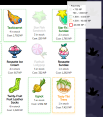

# NeoQOL: Quality of Life Scripts for Neopets
## Enhance Your Neopets Experience

### Disclaimer
All scripts have been developed with caution to stay within the parameters set by The Neopets Team (TNT) policies and guidelines. While scripting remains a contested topic within the Neopets community, we've strived to ensure compliance. Personally, I wouldn't use these scripts on a main account, it's not worth the risk.

> [!CAUTION]
>Use these scripts at your own risk.

### Helpful Resources
For more clarity on the do's and dont's of using scripts on Neopets, check out this comprehensive Reddit guide: [Am I Accidentally Cheating?](https://www.reddit.com/r/neopets/comments/fv06hm/am_i_accidentally_cheating_guide_to_figuring_out/)
  
## Shop [obj #] Item Highlighter
This script highlights items in Shops based on their price categories, making it easier to restock and spot valuable items quickly. The script uses predefined price ranges to apply different styles to items, such as color-coding and borders.

### Features
- **Price Key**: A floating price key on the right side of the screen shows the color codes for different price ranges.
- **Visual Highlights**: Items are color-coded and highlighted based on their price, with subtler items having light grey colors and more expensive ones having bold red borders.

### How to Use
- Install the Script: Download the script and add it to your preferred user script manager such as Tampermonkey.
- Shop Page Matching: The script automatically runs when you visit the Shop page **(/objects.phtml?obj_type=`20`&type=shop)**
### The script highlights items under the following categories:
- 🟦 **< 700 NP**  
- 🟨 **700 - 1,900 NP**  
- 🟩 **1,900 - 4,500 NP**  
- 🟧 **4,500 - 40,000 NP**  
- 🟥 **40,000 NP +**
<!--  -->

## How to Update Item Lists:
To ensure the correct items are highlighted, follow these steps to manually obtain the latest item price lists from Jellyneo. Also, if you want to use this script template and add a different shop.

- Search Items: Visit Jellyneo’s Item Database and search for the desired shop items.
> [Example Search Term](https://items.jellyneo.net/search/?name_type=2&cat[]=11&min_rarity=0&max_rarity=100&min_price=40000&sort=5&sort_dir=desc&limit=75) for Spooky Food (obj 30)
- Filter by Price: Sort the items by price to find those that fall into the desired price categories.
- Install the "JN Item Name Extractor" script to Tampermonkey, found above.
> [!NOTE]
> This script is compliant with JN's Scraping Policy.
- Copy item names: Copy the item names using the copy button provided by the JN script.
- Update the Shop Script: Paste the item names into their respective lists in the script and save it.
- Some items cost more than the SW/ JN price - just remove these as you go, and save.

##
### Pyramids Neopets Script
Automate your Pyramids game on Neopets. This UserScript helps you play the game with less manual interaction.
- **Auto-Play:** Automatically clicks 'Play Again' to start a new game.
- **Smart Moves:** Uses an algorithm to make smart decisions on which card to play next.
- **Random Timing:** Utilizes random timeouts to mimic human interaction.
##
 
## Installation
For all scripts you will need a browser extension.

1. **Download Tampermonkey:**
   - [Chrome Extension](https://chrome.google.com/webstore/detail/tampermonkey/dhdgffkkebhmkfjojejmpbldmpobfkfo)
   - [Firefox Add-On](https://addons.mozilla.org/en-US/firefox/addon/tampermonkey/)
   - [Opera GX Extension](https://addons.opera.com/en/extensions/details/tampermonkey-beta/)
  
2. **Add UserScript:** 
   - Open Tampermonkey Dashboard
   - Click 'Create a new script'
   - Paste the content of `SCRIPT-NAMEjs`

3. **Save and Enable:** 
   - Click 'File' then 'Save'
   - Make sure the script is enabled in Tampermonkey

### Usage
- Navigate to the related page on Neopets
- The script will automatically take action based on the current state.

### Debugging
- Some scripts have debugging included, commented out until needed.
- You may have to use @match over @include, check the URL.

### Contributing
- Fork the repo on [GitHub](https://github.com/uxillary/neo-qol/)
- Clone the project to your machine
- Commit changes to your branch
- Push your changes
- Create a new Pull Request

> [!TIP]
> Contributions are welcome! If you have ideas for improvements, new features, or if you'd like to make changes, feel free to fork the repository and submit a pull request. I'm always open to collaborations and happy to review any updates or suggestions. :smirk:

### License
This project is licensed under the MIT License. See the [LICENSE](LICENSE) file for details.
